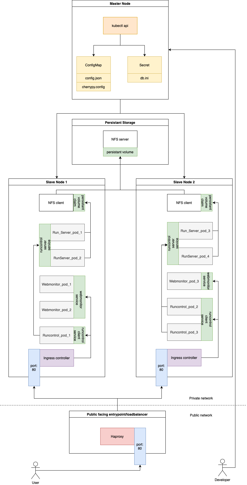

# Creating Kubernetes cluster using CERN OpenStack

- 1x Master Node
- 2x Slave Nodes

## Prerequisites

- Public key uploaded to the Openstack
- Created Openstack project

## Instructions



### Create Master Node VM

1. Log in to https://openstack.cern.ch/project/
2. Select project from top menu
   
3. Navigate to `Project` -> `Compute` -> `Instances` in left bar menu
   
4. Click on `LAUNCH INSTANCE` to create a new VM
   
5. Create Master Node by filling following data into form:
    - Details:
        - Instance Name: `Master-Node`
        - Count: `1`
          
    - Source: click on up arrow next to `ALMA9 - x86_64`
      
    - Flavour: click on up arrow next to `m2.medium`
      
    - Key Pair: click on up arrow next to public key you want to use
      
        - Note: You can add your public key by:
            - clicking on `IMPORT KEY PAIR`
              
            - filling the form
              
    - Configuration: default settings
    - Metadata: default settings
6. Confirm by clicking on `LAUNCH INSTANCE`
   

### Create Master Node VM

1. Log in to https://openstack.cern.ch/project/
2. Select project from top menu
   
3. Navigate to `Project` -> `Compute` -> `Instances` in left bar menu
   
4. Click on `LAUNCH INSTANCE` to create a new VM
   
5. Create Master Node by filling following data into form:
    - Details:
        - Instance Name: `Master-Node`
        - Count: `1`
          
    - Source: click on up arrow next to `ALMA9 - x86_64`
      
    - Flavour: click on up arrow next to `m2.medium`
      
    - Key Pair: click on up arrow next to public key you want to use
      
        - Note: You can add your public key by:
            - clicking on `IMPORT KEY PAIR`
              
            - filling the form
              
    - Configuration: default settings
    - Metadata: default settings
6. Confirm by clicking on `LAUNCH INSTANCE`
   
7. Wait ~ 15min until the Master Node is ready

### Create Slave Node VMs

1. Log in to https://openstack.cern.ch/project/
2. Select project from top menu
   
3. Navigate to `Project` -> `Compute` -> `Instances` in left bar menu
   
4. Click on `LAUNCH INSTANCE` to create a new VM
   
5. Create Master Node by filling following data into form:
    - Details:
        - Instance Name: `Slave-Node`
        - Count: `2`
          
    - Source: click on up arrow next to `ALMA9 - x86_64`
      
    - Flavour: click on up arrow next to `m2.large`
      
    - Key Pair: click on up arrow next to public key you want to use
      
        - Note: You can add your public key by:
            - clicking on `IMPORT KEY PAIR`
              
            - filling the form
              
    - Configuration: default settings
    - Metadata: default settings
6. Confirm by clicking on `LAUNCH INSTANCE`
   
7. Wait ~ 15min until the Master Node is ready

### Configure Kubernetes in Master Node

1. Connect to Master Node
    - Note: you need to be in internal network (e.g. lxplus)
   ```shell
   ssh -i ~/.ssh/<PRIVATE_KEY> root@<MASTER_NODE_IP>
   ```
2. Run `general-init.sh`
    - Note: be aware of used variables there (replace them with values or initialize variables with right values)
3. Run `master-config.sh`
    - Note: Save the last line of the output, you will need it (token and hash) for the registering slaves

### Configure Kubernetes in Slave Node

1. Connect to Master Node
    - Note: you need to be in internal network (e.g. lxplus)
   ```shell
   ssh -i ~/.ssh/<PRIVATE_KEY> root@<SLAVE_NODE_IP>
   ```
2. Run `general-init.sh`
    - Note: be aware of used variables there (replace them with values or initialize variables with right values)
3. Run `slave-config.sh`
    - Note: Use token and hash from last line in master node, if you didn't save it just run
      `kubeadm token create --print-join-command` on master node

### Validate cluster

Run `kubectl get nodes` and you should see something like this:

```text
NAME                   STATUS     ROLES           AGE   VERSION
master-node.cern.ch    Ready      control-plane   34m   v1.31.1
slave-node-1.cern.ch   Ready      <none>          26s   v1.31.1
slave-node-2.cern.ch   NotReady   <none>          10s   v1.31.1
```

### Deploy images (Nginx, Webmonitor, Runcontrol) to the worker nodes

Note: all Dockerfiles necessary to build images can be found in `Dockerfiles` directory

0. Load variables from `.env` file

```shell
source .env
```

1. Build all Docker images locally

```shell
docker buildx build --platform linux/<architecture> -t <image_name>:<image_tag> --build-arg ARCHITECTURE=<architecture> <directory_with_dockerfile>
```

2. Save the Image as a Tar File

- NOTE: you have to <image_name:tag> not <image_id>

```shell
docker save -o <generated_tar_file_path> <image_name:tag>
```

3. Transfer the Image to all Slave Nodes

- NOTE: you have to repeat the process for each slave node

```shell
rsync -avz -e "ssh -i <path_to_private_key>" <generated_tar_file_path> root@<slave_ip>:<path>
```

4. Save the Docker Image on the Slave Node

- NOTE: you have to repeat the process for each slave node

```shell
ctr -n=k8s.io images import <image_path>
```

5. Verify the Imported Image

- NOTE: you have to repeat the process for each slave node

```shell
crictl images | grep <image_name>
```

### Create cluster entrypoint


1. Install `haproxy` (ideally on separate node, but master node is also fine)

```shell
dnf install -y haproxy
```

2. Edit `haproxy` configuration

```shell
vi /etc/haproxy/haproxy.cfg
```

```text
#---------------------------------------------------------------------
# main frontend which proxys to the backends
#---------------------------------------------------------------------
frontend main
bind *:80
stats uri /haproxy?stats
default_backend             app

#---------------------------------------------------------------------
# round robin balancing between the various backends
#---------------------------------------------------------------------
backend app
balance     roundrobin
server  SLAVE_NODE_1 <SLAVE_NODE_1_IP>:80 check
server  SLAVE_NODE_2 <SLAVE_NODE_2_IP>:80 check
```

3. Enable and start `haproxy`

```shell
systemctl status haproxy
systemctl enable haproxy
systemctl start haproxy
systemctl status haproxy
```

### Configure NFS Server & Client

#### Master Node (Server)

1. Install NFS server

```shell
dnf install -y nfs-utils
```

2. Set system DNS name

- Set domain name `Domain = bril-cluster`

```shell
nano /etc/idmapd.conf
```

3. Start & Enable NFS server

```shell
sudo systemctl start nfs-server
sudo systemctl enable nfs-server
```

4. Verify status

```shell
systemctl status nfs-server
```

5. Create shared directory

```shell
mkdir -p /mnt/shared
```

6. Update ownership of that directory

```shell
chown -R nobody:nobody /mnt/shared
chmod 775 /mnt/shared
```

7. Configure NFS server to share that directory

- Add your slaves IP addresses and their permissions
    - ```text
    /mnt/shared <slave_1_ip>(rw,sync,no_subtree_check)
    /mnt/shared <slave_2_ip>(rw,sync,no_subtree_check)
    ```

```shell
nano /etc/exports
```

8. Restart to apply changes

```shell
systemctl restart nfs-server
```

9. Verify configuration

```shell
exportfs -v
```

10. Allow NFS Server in the firewall

```shell
firewall-cmd --add-service={nfs,nfs3,mountd,rpc-bind} --permanent
firewall-cmd --reload
```

#### Slave Nodes (Client)

1. Install NFS client

```shell
dnf install -y nfs-utils
```

2. Check available shared directories on the NFS server

```shell
showmount -e <master_ip>
```

3. Create directory that will be used to mount NFS shared directory

```shell
mkdir -p /shared
```

4. Configure auto-mount

- Add following line `<master_ip>:/mnt/shared    /shared   nfs auto,nofail,noatime,nolock,intr,tcp,actimeo=1800 0 0`

```shell
nano /etc/fstab
```

5. Mount NFS shared directory

```shell
systemctl daemon-reload
mount -a
```

6. Verify successful mount

```shell
df -h
```

### Deploy ingress component

- Note: Perform following actions on Master Node

0. Install Git if you haven't done it yet

```shell
dnf install -y git
```

1. Clone nginx-ingress

```shell
git clone https://github.com/nginxinc/kubernetes-ingress.git
```

2. Change directory

```shell
cd kubernetes-ingress
```

3. Create a namespace and a service account

```shell
kubectl apply -f deployments/common/ns-and-sa.yaml
```

4. Create a cluster role and binding for the service account

```shell
kubectl apply -f deployments/rbac/rbac.yaml
```

5. Create a secret for the default NGINX server’s TLS certificate and key

```shell
kubectl apply -f examples/shared-examples/default-server-secret/default-server-secret.yaml
```

6. Create a ConfigMap to customize your NGINX settings

```shell
kubectl apply -f deployments/common/nginx-config.yaml
```

7. Create an IngressClass and common resources. NGINX Ingress Controller won’t start without an IngressClass resource

```shell
kubectl apply -f deployments/common/ingress-class.yaml
kubectl apply -f config/crd/bases/k8s.nginx.org_virtualservers.yaml
kubectl apply -f config/crd/bases/k8s.nginx.org_virtualserverroutes.yaml
kubectl apply -f config/crd/bases/k8s.nginx.org_transportservers.yaml
kubectl apply -f config/crd/bases/k8s.nginx.org_policies.yaml
kubectl apply -f config/crd/bases/k8s.nginx.org_globalconfigurations.yaml
```

8. Deploy NGINX Ingress as Deployment component

- Note: It has to be daemon-set, because deployment doesn't work

```shell
kubectl apply -f deployments/daemon-set/nginx-ingress.yaml
```

9. Confirm the NGINX Ingress Controller pods are operational and run

```shell
kubectl get pods --namespace=nginx-ingress
```

10. Add DNS record for Haproxy

- Note: For test purposes you can edit `/etc/hosts` on the machine you are going to use for testing

```shell
vi `/etc/hosts`
```

- Note: Hostname `bril-cluster` must be the same as the host from `ingress.yaml`

```text
<HAPROXY_IP>    bril-cluster
```

11. Deploy Ingress Resource (configuration table)

```shell
kubectl apply -f ingress.yaml
```

12. Verify ingress

```shell
kubectl get ing
kubectl describe ing minimal-ingress 
```

13. Configure Firewall

- Note:
    - to list all nodes run ```kubectl get nodes``` on master node
    - to list all pods running on specific slave node run
      ```kubectl get pods --field-selector spec.nodeName=<node_name>``` on master node
    - to find `cali` interface number attached to the pod run
      ```kubectl exec <pod_name> -- ip a | grep -oP 'eth0@if\K\d+'``` on master node
    - to show interface name based on interface number
      ```ip -details link show | grep -A1 "^<interface_number>: " | head -1 | awk -F'[@:]' '{print $2}'``` on slave node

All `cali` interfaces that are attached to webmonitor/runcontrol pods must be added to the firewall configuration on all
slave nodes!

```shell
firewall-cmd --zone=public --permanent --add-interface <interface_name>
```


```shell
firewall-cmd --permanent --add-port=80/tcp
firewall-cmd --permanent --add-service=http
systemctl restart firewalld
firewall-cmd --list-all # verify configuration
```

## Troubleshooting

### 502 Bad Gateway

- most likely incorrect firewall settings

### Restart all pods from deployment

- Note: To see all deployment names run `kubectl get deployments`

```shell
kubectl rollout restart deployment <deployment_name>
```

### Access running container with root privileges

1. From Master node get container ID and node on which it is running

```shell
kubectl get pod <pod_name> -o jsonpath="{.status.containerStatuses[].containerID}" | sed 's,.*//,,'
```

2. Access it as a root via `ctr` from the node where it is running

```shell
ctr --namespace=k8s.io task exec -t --user root --exec-id 1 <container_id> /bin/bash
```

## Resources

- To understand each individual command form the kubernetes script have a look into this
  blog https://kanzal.com/kubernetes-with-kubeadm-on-redhat-9/
- Hands-on example how to load docker image on Slave Node can be found in this
  blog https://medium.com/@tanmaybhandge/how-do-you-use-the-local-images-in-kubernetes-f5cbf375079c
- Video tutorial for Haproxy and Ingress deployment https://www.youtube.com/watch?v=chwofyGr80c
- Calico networking explained https://www.youtube.com/watch?v=NFApeJRXos4
- Creating a K8 cluster with CentOS https://gitlab.cern.ch/bril/readmes/-/tree/master/k8/core?ref_type=heads
- Ingress crash course https://www.youtube.com/watch?v=GhZi4DxaxxE
- NFS server & client on Alma 9 https://www.howtoforge.com/how-to-install-nfs-server-and-client-on-almalinux-9/
